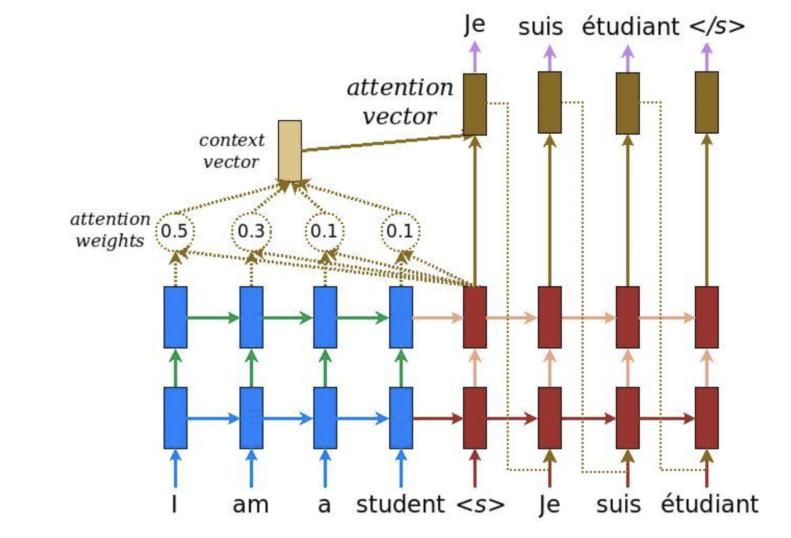

# Neural-Machine-Translation
*	Tackled machine translation with two seq2seq language models, and achieved 38.5 BLEU on kde4 English-to-French task
*	Implemented sequence-to-sequence language model with encoder-decoder architecture using Bi-LSTM as baseline, refined model with attention mechanism and teacher forcing on deep LTSMs, and built autoregressive language generation decoder
*	Improved seq2seq model with transformer architecture with implementation of multi-head attention, masked causal self-attention, residual connection, layer normalization and positional encoding, and outperformed baseline LSTM by 28%

## Approaches
1. Bi-LSTM RNNs Encoder-Decoder Seq2seq
2. Bi-LSTM RNNs Encoder-Decoder SeqsSeq with Attention Mechanism
3. Transformers Encoder-Decoder Seq2seq

## Result
The Encoder-Decoder seq2seq with transformers appproach achieved 38.5 BLEU on kde4 English-to-French task

## Data and Resources Used
**Data:** kde4 English-to-French

**Packages:** PyTorch, TensorFlow, Keras, Numpy

## Approach 1: Bi-LSTM RNNs Encoder-Decoder Seq2seq

## Approach 2: Bi-LSTM RNNs Encoder-Decoder SeqsSeq with Attention Mechanism

## Approach 3: Transformers Encoder-Decoder Seq2seq

